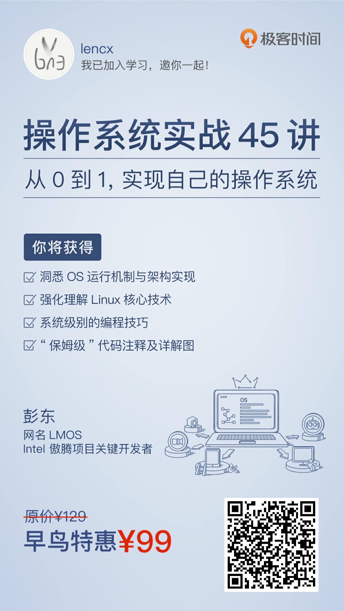

# 操作系统

> 操作系统学习笔记

## 为什么要学习操作系统？

`操作系统是所有软件的基础`，所有上层软件都要依赖于操作系统提供的各种机制，才能运行。

后端工程师，在做高性能服务端编程中的内存，进程，线程，I/O 相关的知识，前端层面的性能调优，操作系统相关知识都必不可少。

### 课程计划

- 了解计算机王国的资源，如 CPU、MMU、内存和 Cache。
- 为这个权利中枢设置基本法，即各种同步机制，如信号量与自旋锁。
- 进行夺权，从固件程序手中抢过计算机并进行初始化，其中包含初始化 CPU、内存、中断、显示等。
- 建设中枢各级部门，分别是内存管理部门、进程管理部门、I/O管理部门、文件管理部门、通信管理部门。
- 将所有部门组合在一起，就形成了计算机王国的权利中枢 —— 操作系统。

从0到1实现一个操作系统

1. 操作系统整体设计
   - 从代码到机器运行
   - 内核结构设计
     - 我们自己的内核设计
     - `Linux 内核架构长什么样`
2. 基础配置与初始化
   - 程序的基石：硬件
     - CPU 工作模式
     - 程序地址
     - Cache 与内存
3. 设计基本法
   - 同步原语
     - ·信号量与自旋锁
     - `Linux 的同步机制`
4. 夺权
   - 启动初始化
     - 设置工作模式与环境
     - 板级初始化
     - `Linux 初始化流程`
5. 土地革命
   - 内存管理
     - 内存的组织与划分
     - 虚拟内存分配与释放
     - `Linux 实现 伙伴系统与 SLAB`
6. 活动实体
   - 进程
     - 进程调度
     - `Linux 怎样实现进程调度`
7. 核心子部门
   - 设备IO
     - 设备类型与驱动
     - 设备注册
     - 内核 IO 包处理
     - `Linux 设备驱动`
   - 银行仓库：文件系统
     - 文件结构与组织
     - 文件操作
     - `Linux 虚拟文件系统`
   - 通信部：网络
     - 内核中的网络数据流动
     - 宏观网络架构
     - `Linux 中 socket 接口详解`
   - 服务交接：接口
     - 服务接口
     - `Linux 系统 API 实现`
8. 虚化的世界
   - KVM
   - 容器
   - ARM架构

## Lesson

- [Lesson 01](./lesson01) - 程序的运行过程：从代码到机器运行

---

  
如果对此课程感兴趣，可以扫码购买

  

