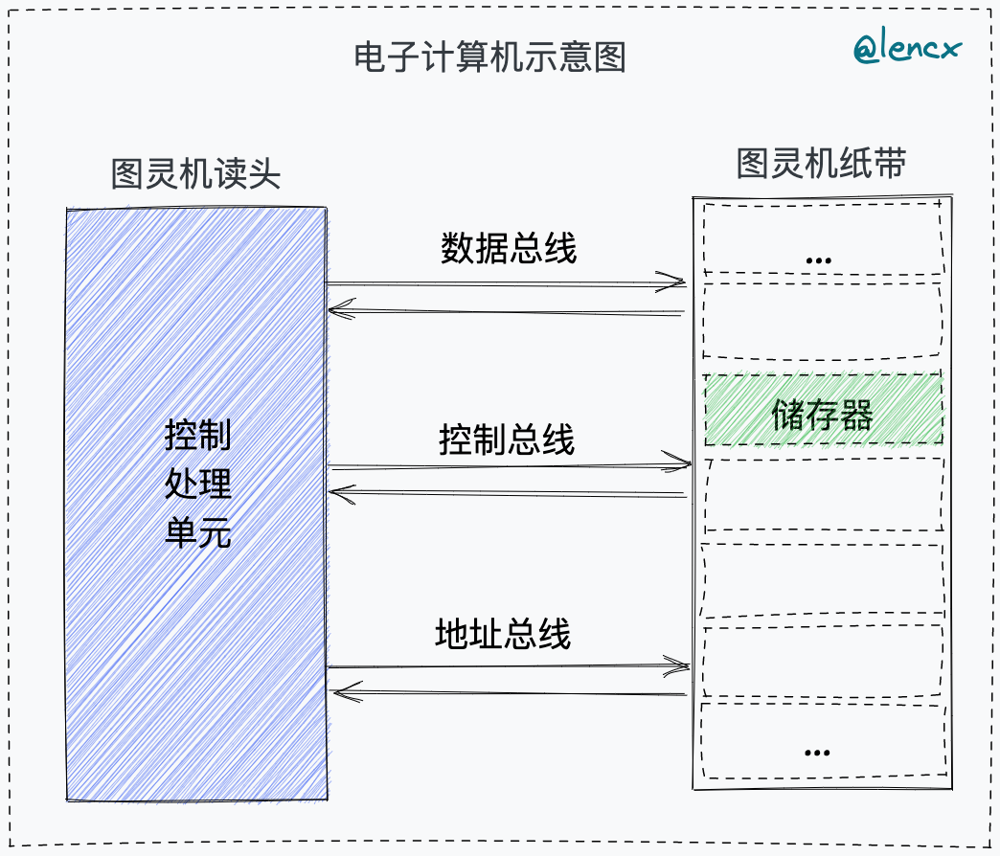
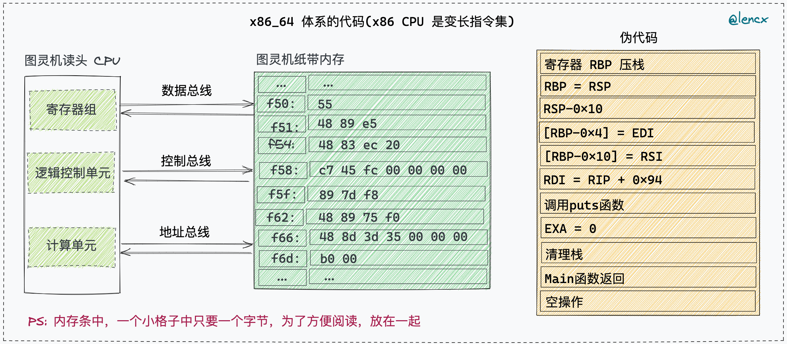

# Hello World

## 编译流程

```bash
              gcc工具链
             ┌───────────┐
hello.c  --> │gcc预处理器 │ --> hello.i
hello.i  --> │ gcc编译器  │ --> hello.s
hello.s  --> │ gcc汇编器  │ --> hello.o
hello.o  --> │ gcc链接器  │ --> hello可执行文件
             └───────────┘
```

```bash
# step1: 预处理：加入头文件，替换宏
gcc -E hello.c -o hello.i

# step2: 编译：包含预处理，将 C 程序转换成汇编程序
gcc -S hello.i -o hello.s

# step3: 汇编：包含预处理和编译，将汇编程序转换成可链接的二进制程序
gcc -c hello.s -o hello.o

# step4: 汇编文件生成可执行文件
gcc hello.o -o hello

# -----------------------------------------------------------

# Linux系统运行可执行文件: `./hello`
gcc hello.c -o hello

# 得到 hello.dump 文件
objdump -d hello >> hello.dump
```


## 背景知识

- [Ken Thompson(肯·汤普逊)](https://en.wikipedia.org/wiki/Ken_Thompson) - Unix 之父，黑客文化圈子通常称他为 “`ken`”
  - UNiplexed Information and Computing System(UNICS) - 上世纪60年代，用 B 语言和汇编语言在 PDP-7 的机器上完成 UNIX 的雏形，一个全新的操作系统。
- [Dennis MacAlistair Ritchie(丹尼·麦卡利斯泰尔·里奇)](https://en.wikipedia.org/wiki/Dennis_Ritchie) - C 语言创造者，Unix 系统关键开发者，黑客圈子通常称他为 “`dmr`”
- [John von Neumann(约翰·冯·诺伊曼)](https://en.wikipedia.org/wiki/John_von_Neumann) 理论计算机科学与博弈论的奠基者

### 冯诺依曼体系结构

`根据冯诺依曼体系结构构成的计算机，必须具有如下功能：`

- 把程序和数据装入到计算机中
- 必须具有长期记住程序、数据的中间结果及最终运算结果
- 完成各种算术、逻辑运算和数据传送等数据加工处理
- 根据需要控制程序走向，并能根据指令控制机器的各部件协调操作
- 能够按照要求将处理的数据结果显示给用户

`为了完成上述的功能，计算机必须具备五大基本组成部件：`

- 装载数据和程序的输入设备
- 记住程序和数据的存储器
- 完成数据加工处理的运算器
- 控制程序执行的控制器
- 显示处理结果的输出设备



```bash
# ./hello/hello.dump

# 地址     十六进制                      汇编代码                   注释
0000000100003f50 <_main>:
100003f50: 55                          	pushq	%rbp
100003f51: 48 89 e5                    	movq	%rsp, %rbp
100003f54: 48 83 ec 20                 	subq	$32, %rsp
100003f58: c7 45 fc 00 00 00 00        	movl	$0, -4(%rbp)
100003f5f: 89 7d f8                    	movl	%edi, -8(%rbp)
100003f62: 48 89 75 f0                 	movq	%rsi, -16(%rbp)
100003f66: 48 8d 3d 35 00 00 00        	leaq	53(%rip), %rdi  # 100003fa2 <dyld_stub_binder+0x100003fa2>
100003f6d: b0 00                       	movb	$0, %al
100003f6f: e8 0e 00 00 00              	callq	0x100003f82 <dyld_stub_binder+0x100003f82>
100003f74: 31 c9                       	xorl	%ecx, %ecx
100003f76: 89 45 ec                    	movl	%eax, -20(%rbp)
100003f79: 89 c8                       	movl	%ecx, %eax
100003f7b: 48 83 c4 20                 	addq	$32, %rsp
100003f7f: 5d                          	popq	%rbp
100003f80: c3                          	retq
```

